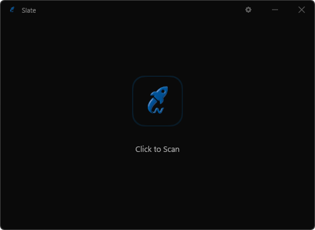

# Slate

Minimal, fast system cleaner for Windows. Written in C++ with Direct2D.
No Electron, no bloat. Just works.

## Features

- **Fast**: Native C++, zero dependencies.
- **Clean**: Custom Direct2D UI, silky smooth animations.
- **Deep Cleaning**:
    - System (Temp, Logs, Dumps, Prefetch, Updates)
    - Browsers (Chrome, Edge, Brave, Opera, Firefox)
    - Apps (Discord, Slack, Spotify, VS Code, Steam, Adobe)
    - Dev (npm, pip)
- **Safe**: Intelligent filtering ignores system/protected paths. Recycles files by default.

## Usage

Download `Slate.exe` from [Releases](../../releases).
Portable, no installation needed.

1. Right-click and **Run as Administrator** (required for deep cleaning).
2. Click the **Slate** icon to scan.
3. Click **"Clean"**.

> **Note:** For best results, **close your web browsers** (Chrome/Edge) before cleaning.

## Troubleshooting

**"Windows protected your PC" Warning:**
Because this is a free, hobbyist tool, it is not digitally signed.
1. Click **More Info**.
2. Click **Run Anyway**.

## License

**Proprietary Freeware.**
Binaries are free to use and redistribute. Source code is private.

Copyright (c) 2026 skyyii. All rights reserved.